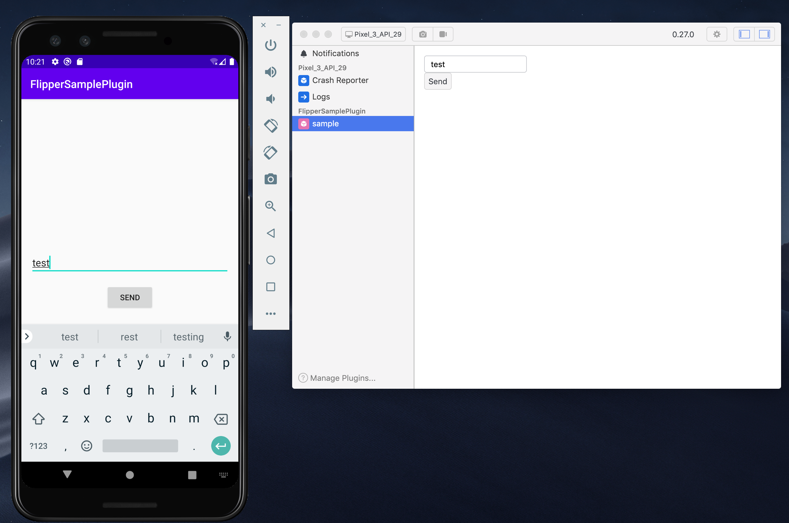

# Flipper Sample Plugin (Android)


Sample implementation of Android [Flipper](https://fbflipper.com/) plugin

## Screenshot



## Setup

Set custom plugin path. Add path to `~/.flipper/config.json`.

```
{"pluginPaths":["<project_path>/flipper-plugins"], ... }
```

## Run Flipper app

```
$ /Applications/Flipper.app/Contents/MacOS/Flipper
```

Note: Don't run from GUI because plugin doesn't compile.
